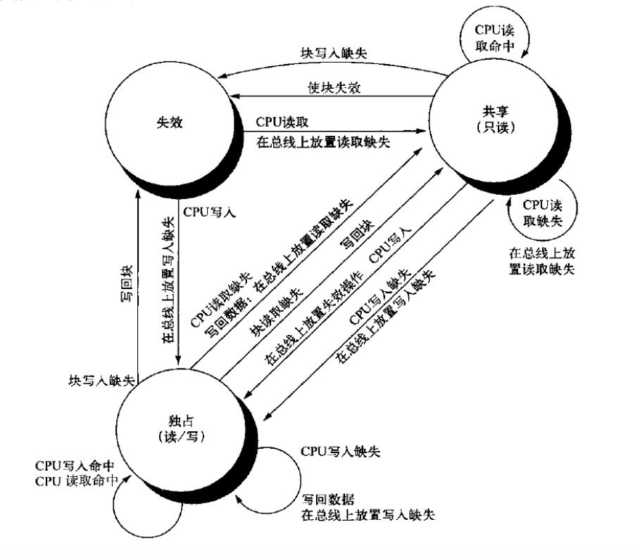

# 选择题 (20*2)
## 选择题考点
- 第一章 4
    - 八大原则 1.5
    - 性能计算 1
    - 功耗墙 1
- 第二章 5
    - 指令格式 1.5
    - 逻辑操作 1
    - 过程 1
    - 寻址 1
    - 编译和执行 1
- 第三章 2
    - 整数运算及溢出 1
    - 浮点数表示 1
- 第四章 4
    - 单周期CPU数据通路
    - 流水线
        - 周期 1
        - 数据通路 1
        - 控制
    - 流水线中的竞争冒险
        - 数据冒险
        - 控制冒险 1
    - 异常 1
- 第五章 5
    - 存储器技术 1
    - Cache 1
    - 多级cache
        - 读写和性能计算 1
        - 一致性 1
    - 可信存储器层次
        - 汉明码 1

## 1

计算机系统结构中的八个伟大思想在我们身边随处可见，将八个伟大思想和身边的案例匹配，下列组合正确的是()
||八大原则思想|身边案例|
|-|-|-|
|①|加速大概率事件|对同一人群多次进行核酸检测|
|②|采用预测提高性能|信息东楼装了三个电梯|
|③|通过冗余提高可信性|食堂根据星期决定做饭量|
|④|采用并行提高性能|男厕占地面积较小的小便池|

- A ①②③④对应③④②①
- B ①②③④对应③④①②
- C ①②③④对应④③①②
- D ①②③④对应④③②①

```
考点：第一章-八大原则
答案：C
解析：根据答案对应
```

## 2

抽象是改进设计的伟大思想之一，最重要的抽象之一是“指令集体系结构(ISA)”，下列对该抽象描述正确的是()

- A 是指高级语言和机器语言之间的接口
- B 是指硬件和底层软件之间的接口
- C 仅包括各种指令(add,sub,jr等)
- D 尽管各种计算机技术(集成电路逻辑技术、半导体DRAM等)在快速发展，但ISA作为一种抽象不需要对这些考虑太多

```
考点：第一章-八大思想-抽象、第二章-指令集体系结构(ISA)
答案：B
解析：参考课本P15。对D选项，快速发展的计算机技术左右着计算机设计的命运，由于计算速度的激增和技术的迅猛发展，一种计算机设计的寿命可能只有3-5年。
```

## 3

下列有关计算机性能的描述不正确的是()

- A 个人电脑一般关心计算机的执行时间，而数据中心往往对吞吐率感兴趣；执行时间也叫响应时间，指从开始一个任务到该任务完成的时间
- B 一味的加速大概率事件不一定能取得理想的性能提升效果
- C 某程序的执行原来需要20秒，在编译器更新后指令数减少为原来的60%，而CPI增加为原来的2倍，现在需要执行24秒
- D 增加计算机的内存可以提升计算机的吞吐率

```
考点：第一章-计算机性能
答案：D
解析：吞吐率是指计算机在单位时间内完成的任务数量，因此增加内存数量并不能提高吞吐率，只有改善内存并减少访存时间，或增加cache才能实现此效果
```

## 4

下面哪个不是影响功耗墙的因素?

- A 指令集
- B 电容
- C 电压
- D 频率

```
考点：第一章-功耗墙
答案：A
解析：影响功耗的因素有负载电容、电压和开关频率
```

## 5

假设如下寄存器内容：
`$t0 = 0xAAAAAAAA`, `$t1 = 0x12345678`
对于以上的寄存器内容，执行下面的指令序列后$t2的值是多少？
```mips
sll $t2, $t0, 4
or  $t2, $t2, $t1
```
- A 0xBABEFFE8
- B 0xBABBEEF8
- C 0xBABEFEF8
- D 0xBABEEEF8

```
考点：第二章-MIPS汇编语言指令的具体含义及计算
答案：C
解析：
sll $t2, $t0, 4   -> $t2 = $t0 << 4
or  $t2, $t2, $t1 -> $t2 = $t2 | $t1
计算可得
```

## 6

以下关于算术移位和逻辑移位的描述错误的是()
- A 逻辑左移时，高位丢失，低位补0
- B 算术左移相当于对原数乘2
- C 逻辑右移相当于对原数除2
- D 算术右移时，符号位不变并向高位复制

```
考点：第二章-逻辑运算
答案：C
解析：
```

## 7

考虑以下的C++代码，以下说法错误的是()
```C++
#include <iostream>
using namespace std;
int N=1;              ①
int func(int* a);
int main()
{
    int *p;
    p = new int (10); ②
    func(p);          ③
    return 0;         ④
}
```
- A 栈自高地址向低地址生长，动态数据段自低地址向高地址生长，这样的结构安排可以充分地利用内存空间
- B 语句①中的数据N将被存于静态数据段中，②中数据存于动态数据段中
- C 语句③使main函数跳转向func函数，调用过程中将使用jr指令
- D 在③中的函数调用返回时，\$fp一般保持不变而\$sp一般逐渐减小

```
考点：第二章-过程
答案：C
解析：应是jal指令，因为jal可以将当前指令的下一条指令的地址存储到\$ra中，并跳转到指令地址，而jr无此功能。所以使用jal指令调用过程，使用jr指令返回
```

## 8

下面哪种寻址方式能够一次性访问内存中字节地址为15A56B0A至15A56B0D的内容

- A 寄存器寻址
- B 基址寻址
- C PC相对寻址
- D 伪直接寻址

```
考点：第二章-寻址
答案：C
解析：这段内存是跨了两个字的四个字节。寄存器寻址查找寄存器而非内存，PC相对寻址和伪直接寻址都是按字寻址，只有基址寻址是按字节寻址
```

## 9

一个C语言程序转换为可执行程序从逻辑上讲需要四个步骤：编译--汇编--链接--加载，下列关于这四个步骤描述错误的是()

- A 编译是将高级语言转换成一种机器能理解的符号形式的汇编语言
- B 链接是将各种代码和数据片段收集并组合成为一个单一文件的过程，这个过程既可以执行于编译时，又可以执行于加载时，但不可执行于运行时
- C 程序经加载后可直接运行
- D 重定位信息是由汇编器生成的

```
考点：第二章-翻译并执行程序
答案：B
解析：链接分为动态链接和静态链接，其中动态链接发生在运行阶段
```

## 10
假定有4个整数，用8位补码分别表示：r1=FEH, r2=F2H, r3=10H, r4=F8H, 若将运算结果存放在一个8位寄存器中，则下列运算会发生溢出的是()
- A r1 * r2
- B r2 * r3
- C r1 * r4
- D r2 * r4

```
考点：第三章-整数运算和溢出
答案：B
解析：选取绝对值最大两个数的相乘，r2 * r3 = F2H * 10H = -14 * 16 = 224，超出8位补码所能表示的范围
```

## 11

假定一8位的浮点格式，其中有k = 4的阶码位和n = 3的小数位。偏移量为$2^3-1=7$，则最小的规格化数（正数）为()

- A 0.0312500 (1/32)
- B 0.0156250 (1/64)
- C 0.0078125 (1/128)
- D 0.0000000 (0)

```
考点：第三章-浮点数表示
答案：B
解析：考虑是正数，因此符号位为0；规格化数的指数位不为0，最小为1，此时指数为-6；尾数最小为0。0 0001 000 = 1/64
```

## 12

下面给出流水线中数据通路中不同阶段的延迟情况：
|IF|ID|EX|MEM|WB|
|-|-|-|-|-|
|250ps|150ps|350ps|300ps|200ps|

对于流水线处理器与非流水线处理器，时钟周期分别至少为()

- A 300ps, 1250ps
- B 350ps, 1150ps
- C 300ps, 1150ps
- D 350ps, 1250ps

```
考点：第四章-周期
答案：D
解析：流水线中的时钟周期是数据通路中时间最长的阶段的时间，而非流水线处理器的时钟周期是各阶段时间相加
```

## 13

关于流水线数据通路，下列说法正确的是()

- A 对存储器的访问发生在MEM阶段
- B PC寄存器的内容每个周期必定变化一次
- C 执行sub指令时RegWrite信号被置有效
- D 符号扩展电路每个周期都在工作

```
考点：第四章-流水线数据通路
答案：D
解析：对数据存储器的访问发生在MEM阶段，对指令存储器的访问发生在IF和WB阶段；对于跳向自身的指令，PC寄存器的值不发生改变；sub指令需要写回寄存器，RegWrite被置有效；符号扩展电路一直在工作，只是结果是否被使用的问题
```

## 14

beq指令会产生控制冒险。在流水线中，如果未经优化，则在预测错误时，需在beq指令的()级清除错误执行的指令，需丢弃()条指令，优化后在()级清除错误执行的指令，需丢弃()条指令

- A WB, 4, ID, 1
- B WB, 4, EX, 2
- C MEM, 3, ID, 1
- D MEM, 3, EX, 2

```
考点：第四章-控制冒险
答案：C
解析：未经优化：EX级计算操作数是否相等并输出信号，MEM级根据结果执行操作，预测正确则继续执行，错误则丢弃掉错误指令并回写PC，下一个时钟周期执行正确的指令；优化后：ID级执行所有操作
```

## 15

以下给出的事件中，无须异常处理程序进行处理的是()

- A 存储访问地址越界
- B 访问cache缺失
- C 缺页故障
- D 除数为0

```
考点：第五章-异常处理
答案：B
解析：访问cache缺失是再正常不过的，甚至是冷启动时必须发生的事；地址越界、缺页故障、除0都有对应的异常
```

## 16

下列关于存储器的描述中正确的是()
- A 对SRAM的读写是破坏性的
- B DRAM的运行速度比SRAM快
- C DRAM的发热量比SRAM少
- D SRAM送行列地址要分两次送

```
考点：第五章-存储器技术
答案：C
解析：对DRAM读写是破坏性的，而SRAM不是；SRAM比DRAM快；因为DRAM的逻辑元件比SRAM少，所以发热少；DRAM需分两次送，SRAM一次即可
```

## 17

下面给出几个不同的高速缓存的参数，其中大小均为字节。确定其高速缓存组数、标记位数、组索引位数以及块偏移位数分别是

| 地址位数 | 大小（不包括有效位标记位） | 块大小 | 每组块数 |
| ------- | :----------------------: | ----- | ------- |
| 32      |           1024           | 8     | 4       |

- A 16, 23, 6, 3
- B 32, 22, 8, 2
- C 16, 25, 4, 3
- D 32, 24, 5, 3

```
考点：第五章-Cache存储组织结构
答案：D
解析：每组大小为4*8 = 32字节，则共有1024/32 = 32组，则组索引位数为lb(32) = 5；每块大小为8字节，则块偏移位数为lb(8) = 3；标记 = 32-5-3 = 24
```

## 18

采用汉明校验的编码，当有效信息位为12位时，需要设置的校验位为()

- A 3
- B 4
- C 5
- D 6

```
考点：第五章-汉明码
答案：C
解析：2的整数次幂位置上是校验位，因此有ppdp dddp dddd dddp d
```

## 19

假定处理器基本CPI为1.0，所有访问在一级cache中均命中，时钟频率为4GHz。假设主存访问时间为85ns，其中包括缺失处理时间，设一级cache中每条指令缺失率为3%。如果增加一个二级cache，命中或者缺失访问的时间都是5ns，已知改进后的处理器性能是没有二级cache性能的2.24倍，则二级cache访问主存的缺失率为()

- A 0.6%
- B 0.8%
- C 1.0%
- D 1.2%

```
考点：第五章，多级cache的性能计算
答案：C
解析：主存的缺失代价为85ns/(0.25ns/时钟周期) = 340个周期，而只有一级cache的处理器的有效CPI是1.0+每条指令的存储器阻塞时钟周期 = 1.0+3% x 340 = 11.2。二级cache的CPI是11.2/2.24=5.0.访问二级cache的缺失代价为5ns/(0.25ns/时钟周期) = 20个周期。设二级cache访问主存的缺失率为a，则总的CPI = 1 + 一级cache中每条指令的阻塞 + 二级cache中每条指令的阻塞 = 1 + 3% x 20 + a x 340 = 5。解得a = 0.5%
```

## **20**

以下是一个双核CPU，设其中的CPU分别为A和B，我们假设A和B的cache都是只有2个块，且每个块大小均为1个字，分别采取全相联和LRU替换算法，无多级cache，现有下列CPU动作：
```mips
A：lw  $t2, 0($t1);         //$t1=0x00004000
B：add $t3, $zero, $zero;
B：sw  $t3, 0($t1);
A: lw  $t3, 0($t1);
```

- A 为了提高效率，多核CPU不仅可以共享cache，也可以共享寄存器
- B 若采用监听协议，第四条指令中A会发生cache缺失
- C 若每个处理器自身的指令顺序不变，但可以交换不同处理器之间指令的顺序，如可以交换第一条核第二条指令的执行顺序，则缺失数最高为2，最低为1
- D 第三条指令发生后B可以将数据复制至A，这可以降低访问开销

```
考点：第五章-Cache一致性
答案：ACD
解析：处理器之间的寄存器都是互相独立的；若采用监听协议，第三条指令发生后其他处理器的cache中的对应地址将被无效化，故会发生缺失；缺失数最高为ABBA，最低为BBAA；维持一致性可以采取迁移和复制的技术
```

# 计算题
## 1
`考察范围：第二章`
考虑用一段C语言程序和它编译为MIPS指令的版本，其中array为长度为len的int类型数组，array的首地址已保存在$s0中，len保存已在$s1中，回答下列问题
```C
int f1(int arg){
    if(arg>=0 && arg<len)
        return array[arg];
    else return 0;
}

void f2(int arg){
    for(int i=-arg; i<=arg; i++)
        f1(i);
}
```

```mips
f1:
    addi $sp, $sp, -8
    sw   $a0, 4($sp)
    sw   $ra, 0($sp)
    # (1)
    beq  $t0, $zero, else
    # (2)
    j    rtn
else:
    add  $v0, $zero, $zero
rtn:
    lw   $ra, 0($sp)
    lw   $a0, 4($sp)
    addi $sp, $sp, 8
    jr   $ra

f2:
    addi $sp, $sp, -8
    sw   $ra, 4($sp)
    sw   $a0, 0($sp)
    # (3)
loop:
    jal  f1
    addi $t0, $t0, 1
    slt  $t1, $a0, $t0
    beq  $t1, $zero, loop
    lw   $a0, 0($sp)
    lw   $ra, 4($sp)
    addi $sp, $sp, 8
    jr   $ra
```

1. 完成这段MIPS汇编语言代码，要求执行的指令条数尽可能优化
2. x为整数且|x|\<len，计算调用f2(x)需要执行的指令条数

答案：
```
1.
(1)
sltu $t0, $a0, $s1
(2)
sll  $t0, $s1, 2
add  $t0, $s0, $t1
lw   $v0, 0($t0)
(3)
sub $t0, $zero, $a0

2.
设考生答案中三个空的指令条数为a、b、c，如参考答案写法中a=1，b=3，c=1
f1(x)在x未出界时需要执行9+a+b条，出界时需要执行9+a条
考虑|x|<len，因此x<0时出界，x>0时不出界
f2(x)需要执行7+c+(9+a+4)x+(9+a+b+4)(x+1)=20+a+b+c+(26+2a+b)x
如参考答案写法中该式为25+31x
```

## 2
`考察范围：第三章`
设机器数字长为8位（含一位符号位），用补码运算规则计算以下题目：

1. a=9/64, b=-13/32, 求a+b
2. a=-87, b=53, 求a-b

答案：
```
1. a=0.001001, b=-0.01101, 则[a]补=0.0010010, [b]补=1.1001100
[a+b]补=[a]补+[b]补=0.0010010+1.1001100=1.1011110

2. a=-1010111, b=110101, 则[a]补=10101001, [b]补=110101
[-b]补=11001011
[a-b]补=[a]补+[-b]补= 11010001+11001011=01110100 (进位丢弃)
```

## 3
`考察范围：第四章`
设一五级流水线的时钟周期为t，观察下列指令：
```
LOOP:
add $s1, $s2, $s3
lw $t1, 0($s1)
sll $t2, $t1, 2
sw $t1, 0($sp)
lw $t2, 0($s1)
beq $t1, $t2, LOOP
```
回答以下问题：
1. 不考虑分支冒险，如果不使用旁路，需要插入多少个nop？假设不包括最后一条指令，总耗时为多少？若使用全旁路技术，可以得到多少的加速比？
2. 如果同时考虑到数据冒险和分支冒险，采用全旁路技术，若不进行任何分支优化，假设该循环总共循环100次(即前99次跳转，最后一次不跳转)，请求出总用时；若假定分支总发生，请求出总用时；若使用分支延迟缩短技术，将分支条件判断提前至ID级，请求出总用时。
3. 有哪些指令可能会出现异常，会出现什么样的异常，将会在流水线的哪一级被检测到？

答案：
```
1. 需要插入5个nop
LOOP:
add $s1, $s2, $s3
nop
nop
lw $t1, 0($s1)
nop
nop
sll $t2, $t1, 2
sw $t1, 0($sp)
nop
lw $t2, 0($s1)
beq $t1, $t2, LOOP
无旁路：5t+(10-1)t=14t
全旁路：5t+(5+1-1)t=10t，注意旁路可以解决load-use以外的所有阻塞，而load-use仍要阻塞1个时钟周期
加速比：14t/10t=1.4

2. 在前99次中，因为不采用任何分支技术，因此每个beq后总要阻塞3个时钟周期，即beq后插入3个nop，又第一次的第一条指令需要额外消耗4t：4t+99*(5+1+1+3)=994t；注意最后一次因为退出了循环，所以最后3个nop不影响循环所耗时间：1*(5+1+1)=7t；总时间：990t+7t=1001t。  
假定分支总发生的话，前99次都可以顺利执行循环自身的内容，即：4t+99*(5+1+1)=697t，最后一次虽然会预测错误导致阻塞，但此时循环已执行完毕不产生影响：7t；总时间：704t。
提前至ID级，仍需要清除IF级的指令，因此：4t+99*(5+1+1+1)+7t=803t。

3. add：算术溢出(EX)，lw、sw：无效地址(MEM)，beq：无效地址(EX)
```

## **4** (15)
`考察范围：第五章`


如图一所示的简单多核多处理器给出了一种经常实现的对称共享存储器体系结构。每个处理器拥有单个专用缓存，使用图二的监听式一致性协议来保持一致性。每个缓存都是直接映射的，共有四个块，每个块保存两个字。为了简化说明，缓存地址标签中包含了完整的地址，每个字仅显示两个十六进制字符，最低有效字位于右侧。一致性状态表示为M、S和I（已修改、共享和无效）。

假定初始缓存与存储器状态如图一所示。

CPU操作格式为 `P#: <op> <address> [<value>]`

其中，P#指明CPU（例如，P0）、\<op\>是CPU操作（例如，读取或写入）、\<address\>表示存储器地址、\<value\>指示在写入操作时指定的新字。将以下每个操作看作是独立应用于图一给定的初始状态。请问：

1. 在给定操作之后，缓存和存储器的结果状态是怎样的（即，一致性状态、标签和数据）？写入数据默认放在右边的块。仅给出发生变化的块，例如，P0.B0:(I,120,00 01)表示CPU P0的 B0 块最终状态为 I，标签为120，数据字为00和01。

2. 每个读操作返回什么样的值？

```
a. P0: read 120
b. P0: write 120 ← 80
c. P2: write 120 ← 80
d. P1: read 110
e. P0: write 108 ← 48
f. P0: write 130 ← 78
g. P2: write 130 ← 78
```

答案：
```
a. P0: read 120 → P0.B0: (S,120,0020) 返回0020
因为P2.B0 存有相同的数据 所以状态为 S 共享
b. P0: write 120 ← 80 →P0.B0: (S,120,0080)
P2.B0: (I,120,0020)
写入数据 置其他副本无效 改写入块为M 已修改
c. P2: write 120 ← 80 →P2.B0: (M,120,0080)
注意题中所述“将以下每个操作看作是独立应用于图一给定的初始状态。”
d. P1: read 110 →P1.B2:(S,110,0010) 返回0010
e. P0: write 108 ← 48 →P0.B1: (M,108,0048)
P2.B1: (I,108,0008)
f. P0: write 130 ← 78 →P0.B2: (M,130,0078)
M:110 0030 (写回memory)
110修改过 换出时要写回
g. P2: write 130 ← 78 →P2.B2: (M,130,0078)
a,b,c,d,e,g均为2分 f为3分
```

# 材料题 不属于试卷

考虑一段C语言代码，该段代码用于计算两个向量的点积：
```C
float dotprod(float x[8], float y[8]){
    register float sum = 0.0;
    register int i;
    for(i=0; i<8; i++)
        sum += x[i] * y[i];
    return sum;
}
```
其中，x和y在内存中占据连续的一块空间，单精度浮点数长度为四字节。Cache的一个块为16字节，由两个组组成。

1. 对于x和y来说，这个函数都具有良好的空间局部性，因此我们期望其命中率较高，但事实并非总是如此。请简要说明命中率降低的原因

2. 对上述现象产生的问题，请给出可行的优化方案

答案：
1. 不失一般性，假设x首地址为0。此时x[0]~x[3]占据0~31字节，将被装载在块0，同理，x[4]~x[7]装载在块1，y[0]~y[3]装载在块0，y[4]~y[7]装载在块1。可以看出，x和y相同下标的元素装载在同一个块，会互相覆盖，恰恰这两个元素又连续被访问，因此会反复引起冲突。实际上，考虑该假设下程序运行时cache存储情况
|访问|0|1|H/M|
|-|-|-|-|
|x[0]|x[0]~x[3]||M|
|y[0]|y[0]~y[3]||M|
|x[1]|x[0]~x[3]||M|
|y[1]|y[0]~y[3]||M|
|x[2]|x[0]~x[3]||M|
|y[2]|y[0]~y[3]||M|
|x[3]|x[0]~x[3]||M|
|y[3]|y[0]~y[3]||M|
|x[4]|y[0]~y[3]|x[4]~x[7]|M|
|y[4]|y[0]~y[3]|y[4]~y[7]|M|
|x[5]|y[0]~y[3]|x[4]~x[7]|M|
|y[5]|y[0]~y[3]|y[4]~y[7]|M|
|x[6]|y[0]~y[3]|x[4]~x[7]|M|
|y[6]|y[0]~y[3]|y[4]~y[7]|M|
|x[7]|y[0]~y[3]|x[4]~x[7]|M|
|y[7]|y[0]~y[3]|y[4]~y[7]|M|

命中率为0

2. 考虑若将x和y相同下标的元素装载在不同的块，即可降低这一损失。为实现这一目的，可以用冗余填充部分空间，将y的首地址align到可被装载在块1的域内。例如，将x定义为`float x[12]`，可以使y[0]~y[3]装载在块1，y[4]~y[7]装载在块0。立即有cache存储情况
|访问|0|1|H/M|
|-|-|-|-|
|x[0]|x[0]~x[3]||M|
|y[0]|x[0]~x[3]|y[0]~y[3]|M|
|x[1]|x[0]~x[3]|y[0]~y[3]|H|
|y[1]|x[0]~x[3]|y[0]~y[3]|H|
|x[2]|x[0]~x[3]|y[0]~y[3]|H|
|y[2]|x[0]~x[3]|y[0]~y[3]|H|
|x[3]|x[0]~x[3]|y[0]~y[3]|H|
|y[3]|x[0]~x[3]|y[0]~y[3]|H|
|x[4]|x[0]~x[3]|x[4]~x[7]|M|
|y[4]|y[4]~y[7]|x[4]~x[7]|M|
|x[5]|y[4]~y[7]|x[4]~x[7]|H|
|y[5]|y[4]~y[7]|x[4]~x[7]|H|
|x[6]|y[4]~y[7]|x[4]~x[7]|H|
|y[6]|y[4]~y[7]|x[4]~x[7]|H|
|x[7]|y[4]~y[7]|x[4]~x[7]|H|
|y[7]|y[4]~y[7]|x[4]~x[7]|H|
命中率为75%
